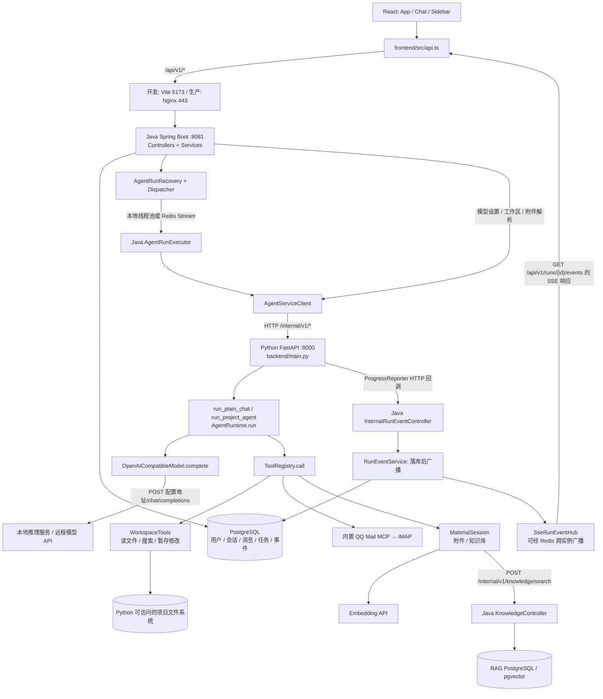
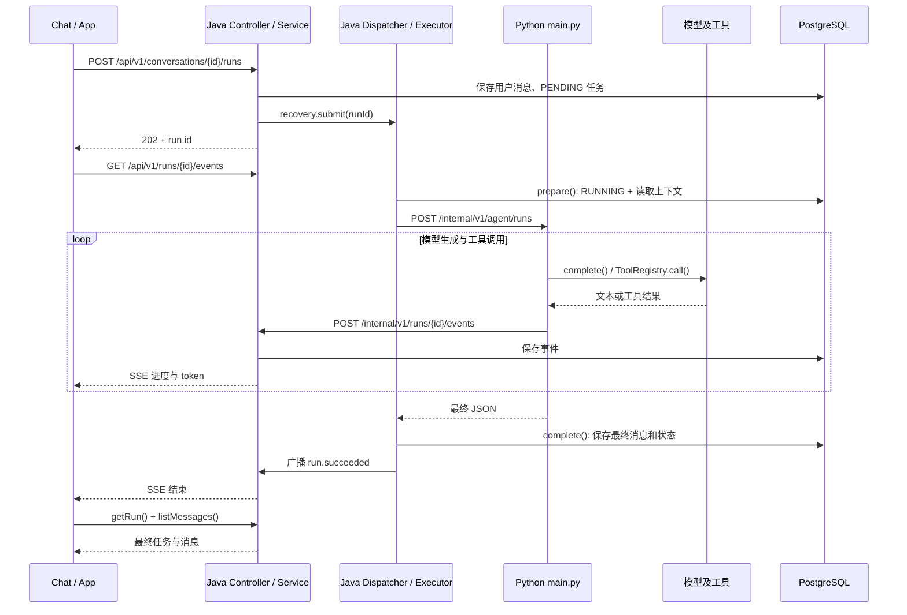

# 项目完整调用链：前端 → Java → Python → 模型与工具

基于 2026-09-26 当前工作区源码梳理。本文是静态代码追踪；端口和服务地址取自仓库配置，未代表当前机器上的服务已经启动。

## 1. 先建立整体认识

系统的正式 Web App 分成三层：

| 层 | 入口 | 主要职责 |
| --- | --- | --- |
| React | `frontend/src/main.tsx` → `App.tsx` | 页面、输入、文件预览、进度展示；统一通过 `api.ts` 访问 Java |
| Spring Boot | `BusinessServiceApplication.java` | 登录和授权、会话消息、任务调度与状态、数据库、对外 SSE |
| FastAPI | `backend/main.py` 的 `app` | 接收任务、调用模型、执行工具、管理工作区、向 Java 上报进度 |
| Agent 核心库 | `agent_framework/runtime.py` | “调用模型 → 执行工具 → 回填结果 → 再调用模型”的循环 |

Java 源文件下文使用包内路径，根目录为 `business-service/src/main/java/com/aioagent/business/`。例如 `run/AgentRunService.java` 就是该根目录下的文件。最后的源码索引可直接点击跳转。

### 整体架构图



这里有三种不同的“接口”：

1. **HTTP API**：例如前端请求 Java 的 `/api/v1/conversations/{id}/runs`。
2. **进程内函数调用**：例如 Java 的 `AgentRunExecutor.execute()` 调 `AgentRunService.prepare()`。
3. **模型工具接口**：例如 `file_read`、`knowledge_search`，是发给模型的工具描述，由 Python Runtime 解析模型返回的调用并执行。

`AgentServiceClient` 是 Java 调 Python 的客户端；`backend/main.py` 中的 FastAPI 路由才是这些内部 HTTP 接口的提供方。

## 2. 最重要的链路：点击“发送”后发生什么

### 2.1 前端发起任务

```text
frontend/src/Chat.tsx: submit()
  → props.onSend(task, materials)
  → frontend/src/App.tsx: send()
  → frontend/src/api.ts: api.createRun()
  → request() → fetch()
  → POST /api/v1/conversations/{conversationId}/runs
```

请求里包含 `task`、`mode`、`project_id`、`approval_mode`、`max_history_messages`、`attachment_ids`、`knowledge_ids`，并带 `Idempotency-Key`。登录后还会带 `Authorization: Bearer ...`。

`model_id` 不是这个请求临时提交的：它提前保存在会话上，由 Java 创建任务时读取。

开发环境由 `frontend/vite.config.ts` 把 `/api` 转发到 `http://127.0.0.1:8081`；生产环境由 `frontend/nginx.conf` 的 `/api/` 转发到 `business-service:8081`。

### 2.2 Java 接口接住请求并保存任务

```text
run/AgentRunController.java: create()
  → CurrentUser.require() 获取当前用户
  → run/AgentRunService.java: create()
      → ModelOptionsService.requireSelectable() 校验会话所选模型
      → createTransactional()
          → 校验幂等、额度、会话权限、并发运行、项目权限
          → MaterialService.snapshot() 固定本次选择的资料
          → MessageRepository.save() 保存用户消息
          → AgentRunRepository.save() 保存 PENDING 任务
          → RunEventService.append("run.created")
  → run/AgentRunRecovery.java: submit(runId)
  → 返回 HTTP 202 和 run 对象
```

重复幂等请求返回已有任务和 HTTP 200。这里返回的是任务记录；最终回答随后产生。

### 2.3 Java 在后台调度执行

```text
AgentRunRecovery.submit()
  → AgentRunService.claimDispatch() 领取调度租约和 dispatchToken
  → AgentRunDispatcher.dispatch()
      ├─ Redis 关闭: LocalAgentRunDispatcher.dispatch()
      │    → ThreadPoolTaskExecutor → AgentRunExecutor.execute()
      └─ Redis 开启: RedisAgentRunDispatcher.dispatch()
           → Redis Stream 写入 run_id + dispatch_token
           → RedisAgentRunDispatcher.receive() 消费
           → ThreadPoolTaskExecutor → AgentRunExecutor.execute()
```

**Redis Stream 的消费者仍然是 Java。** Java 消费后才通过 HTTP 调 Python；Python 不在这里直接消费任务 Stream。

`application.yml` 独立启动的默认值是 Redis 关闭；`docker-compose.yml` 和 `docker-compose.prod.yml` 都显式开启 Redis。

### 2.4 Java 拼好执行上下文，调用 Python

```text
run/AgentRunExecutor.java: execute(runId, dispatchToken)
  → AgentRunService.prepare()
      → 检查状态和 dispatchToken
      → PENDING 改为 RUNNING
      → buildHistory() 从业务数据库获取历史消息
      → McpServerService.executionConfigs() 获取已启用连接器配置
      → MaterialService.execution() 获取附件分段和知识库选择
  → 开启 heartbeat 续租
  → 构造 AgentServiceClient.ExecutionRequest
  → agent/AgentServiceClient.java: execute(request)
  → POST /internal/v1/agent/runs
```

Java 传给 Python 的上下文还包括 `run_id`、用户及工作区所有者 ID、`workspace_root`、模型 ID、历史消息、最大步数、`trace_id`、`callback_url`。Java 的 Jackson 配置使用 `SNAKE_CASE`，所以 Java 的 `runId` 序列化为 Python 接收的 `run_id`。

Python 地址由 `AGENT_SERVICE_BASE_URL` 指定；Compose 中为 `http://agent-service:8000`。请求附带 `X-Internal-Token` 和 `X-Trace-Id`。

### 2.5 Python 根据模式选择执行路径

入口是 `backend/main.py: execute_agent_run()`，对应 `POST /internal/v1/agent/runs`。

```text
execute_agent_run()
  → ProgressReporter(...) 建立进度回调
  → cancellations.begin() 建立取消信号
  → MaterialSession(...) 建立本次资料上下文
  ├─ mode == "project" → run_project_agent()
  └─ mode == "chat"    → run_plain_chat()
  → MaterialSession.finish() 整理来源、引用与检索记录
  → 返回 final_answer、steps、proposed_changes、用量等 JSON
```

| 分支 | 实际行为 |
| --- | --- |
| 普通聊天，没有连接器或资料工具 | `run_plain_chat()` → `OpenAICompatibleModel.complete(messages, tools=[])` |
| 普通聊天，存在连接器或资料工具 | `run_plain_chat()` → `AgentRuntime.run()`，可使用只读邮箱、附件、知识库工具 |
| 项目工作 | `run_project_agent()` → `build_workspace_tools()` → 合并连接器与资料工具 → `AgentRuntime.run()` |

所以，“chat 模式”也可能执行工具；是否进入工具循环取决于本次可用工具集合。

### 2.6 Agent 如何调用模型和工具

真实循环实现在 `agent_framework/runtime.py: AgentRuntime.run()`。`backend/agent_runtime.py` 只是重新导出这个类。

```text
AgentRuntime.run()
  → ToolRegistry.specs() 得到工具 JSON Schema
  → OpenAICompatibleModel.complete(messages, tools)
      → POST {model_api_base 去掉末尾斜杠}/chat/completions
      → 读取模型流式响应、累积文本或 tool_calls
  ├─ 没有 tool_calls → 返回最终回答
  └─ 有 tool_calls
       → 解析 function.name / function.arguments
       → ApprovalPolicy.check()
       → ToolRegistry.call(name, arguments)
       → 查找注册的 Tool.handler 并调用 Python 函数
       → 把结果作为 role=tool 消息加入 messages
       → 下一轮调用模型
```

模型 HTTP 客户端在 `agent_framework/model.py: OpenAICompatibleModel.complete()`。如果配置地址本身带 `/v1`，最终路径就是 `/v1/chat/completions`；代码不会统一额外补一个 `/v1`。

模型本身返回“调用哪个工具及参数”；真正读文件、检索和访问邮箱的动作由 Python 执行。

### 2.7 进度怎样回到页面

```text
模型 token / Runtime 的步骤和工具事件
  → backend/main.py: ProgressReporter.emit()
  → _send() → post_json(callback_url)
  → POST Java /internal/v1/runs/{runId}/events
  → internal/InternalRunEventController.java: event()
  → AgentRunService.recordAgentEvent()
  → RunEventService.append()
      → RunEventRepository.saveAndFlush() 保存事件
      → 事务提交后 RunEventBroadcaster.broadcast()
  → LocalRunEventBroadcaster 或 RedisRunEventBroadcaster
  → SseRunEventHub.publish()
  → 前端 api.streamRunEvents() 读取 SSE
  → App.send() 的 onEvent 回调更新进度、文本、来源
  → Chat.tsx 显示
```

前端订阅的是 `GET /api/v1/runs/{runId}/events`，由 `AgentRunController.events()` → `SseRunEventHub.subscribe()` 提供。订阅时会从数据库补发事件；重连使用 `Last-Event-ID`。

Python 的 `ProgressReporter` 会缓冲 token，达到 80 字符后发送，其他事件前也会刷新缓冲。它不是把模型的原始 SSE 连接直接透传到浏览器。

跨 Java 实例时，Redis 广播实例标识和事件 ID，接收实例再读数据库事件并发给自己的浏览器订阅者。

### 2.8 最终回答如何保存

Python 执行接口一直等到本次运行结束才返回最终 JSON。Java 后台线程接到响应后：

```text
AgentRunExecutor.execute()
  → AgentRunService.complete(runId, response)
      → 任务状态设为 SUCCEEDED
      → 保存回答、用量、模型信息、修改提案
      → MessageRepository.save() 保存 ASSISTANT 消息及 sources/retrievals
      → RunEventService.append("run.succeeded")
  → SSE 收到结束事件并关闭
  → App.send() 调 api.getRun()
  → refreshConversations() + loadMessages()
  → 页面使用数据库中的最终消息
```

SSE 出错时前端通过 `api.waitForRun()` 轮询任务状态。`agent.completed` 是 Python 的阶段事件；Java 的 `run.succeeded` 才表示业务侧完成保存。

### 一次发送的时序图



## 3. 项目文件：浏览、手动保存、Agent 修改是三条链

### 3.1 浏览和手动编辑

下表公开接口均以 `/api/v1` 为前缀，内部接口均以 `/internal/v1` 为前缀。Java 接收文件为 `project/ProjectController.java`，Java → Python 的调用都经过 `agent/AgentServiceClient.java`；Python 路由都在 `backend/main.py`。

| 用户动作 / 前端调用方 | api.ts 函数 → 公开接口 | Java 方法 → Client 方法 | Python 接口 → 路由函数 → workspace.py 函数 |
| --- | --- | --- | --- |
| FolderPicker.navigate | `listDirectories` → GET `/workspaces/directories` | `directories` → `listDirectories` | GET `/workspaces/directories` → `workspace_directories` → `list_directories` |
| App.openProject | `openProject` → POST `/projects/open` | `open` → `ProjectService.open` → `openWorkspace` | POST `/workspaces/open` → `open_workspace` → `normalize_workspace_root` + `build_workspace_tree` |
| App.refreshProjects | `listProjects` → GET `/projects` | `list` → `ProjectService.list` | Java 查询业务数据库 |
| App.selectExistingProject / refreshWorkspace | `workspaceTree` → GET `/projects/{id}/workspace/tree` | `tree` → `workspaceTree` | GET `/workspaces/tree` → `workspace_tree` → `build_workspace_tree` |
| Sidebar 选择文件 → App.selectFile | `workspaceFile` → GET `/projects/{id}/workspace/file` | `file` → `workspaceFile` | GET `/workspaces/file` → `workspace_file` → `read_workspace_file` |
| CodePreview 保存 → App.saveFile | `saveWorkspaceFile` → PUT `/projects/{id}/workspace/file` | `saveFile` → `saveWorkspaceFile` | PUT `/workspaces/file` → `save_workspace_file` → `write_workspace_file` |

Java 根据 `projectId` 找数据库里的 `workspace_root`，检查成员权限后再传给 Python。文件内容实际来自 Python 能访问的文件系统；容器运行时需要相应卷挂载。“打开本地目录”指执行服务可见的目录。

### 3.2 模型工具如何注册到函数

注册点：`backend/workspace.py: build_workspace_tools(root)`；统一消费点：`agent_framework/runtime.py: AgentRuntime.run()` → `agent_framework/tools.py: ToolRegistry.call()`。

| 给模型的工具名 | Python 实现 | 行为 |
| --- | --- | --- |
| `list_files` | `WorkspaceTools.list_files` | 列目录 |
| `file_read` | `WorkspaceTools.read_file` | 读项目文件或已暂存内容 |
| `search_files` | `WorkspaceTools.search_files` | 搜索项目文本 |
| `file_write` | `WorkspaceTools.write_file` → `_stage` | 暂存完整内容 |
| `apply_patch` | `WorkspaceTools.apply_patch` → `_stage` | 暂存精确文本替换 |
| `git_diff` | `WorkspaceTools.git_diff` → `_diff_for` | 生成 Agent 暂存修改的 diff；不是创建 Git commit |
| `run_tests` | `WorkspaceTools.run_tests` | 环境开关启用才注册；在带暂存内容的临时副本执行固定测试命令 |

这些工具名不是 FastAPI URL。例如模型调用 `file_read`，Runtime 会直接调用 Python handler，不会绕回 Java 的文件预览接口。

### 3.3 Agent 改文件要经过提案确认

```text
模型调用 file_write / apply_patch
  → WorkspaceTools._stage() 暂存
  → WorkspaceTools.proposals() 生成 path/content/diff/original_sha256
  → run_project_agent() 返回 proposed_changes，changed_files 暂为空
  → Java AgentRunService.complete() 保存提案
  → App.send() 检查 change_status == PROPOSED
  → ChangeProposalPanel 展示 diff

用户点击应用
  → App.applyProposedChanges() → api.applyRunChanges()
  → POST /api/v1/runs/{runId}/changes/apply
  → AgentRunController.applyChanges()
  → WorkspaceChangeService.apply()
  → AgentRunService.claimProposedChanges()
  → AgentServiceClient.applyWorkspaceChanges()
  → POST /internal/v1/workspaces/changes/apply
  → backend/main.py: apply_proposed_workspace_changes()
  → WorkspaceApplyRegistry.execute() 按 operation_id 去重
  → backend/workspace.py: apply_workspace_changes()
  → 校验原文件 SHA-256、执行写入
  → Java completeProposedChanges() → 前端刷新目录和文件
```

拒绝链路：`App.rejectProposedChanges()` → `api.rejectRunChanges()` → `POST /api/v1/runs/{id}/changes/reject` → `AgentRunController.rejectChanges()` → `AgentRunService.rejectProposedChanges()`，结束于 Java。

**手动保存编辑器内容会直接写文件；Agent 修改先形成提案。** 两者虽然最终都操作工作区，调用入口和状态流程不同。

## 4. 登录、会话、模型管理接口

所有公开路径均省略 `/api/v1` 前缀。

### 4.1 身份认证

提供方：`auth/AuthController.java` → `AuthService.java` / `JwtService.java` / 用户与 token 仓储。这组业务不调用 Python。

| 方法 + 路径 | api.ts 调用 / 页面使用方 | Controller 方法 |
| --- | --- | --- |
| GET `/auth/config` | `authConfig` / AuthScreen | `config` |
| POST `/auth/login` | `login` / AuthScreen.submit | `login` |
| POST `/auth/register` | `register` / AuthScreen.submit | `register` |
| POST `/auth/refresh` | `restoreSession`、`request` 的 401 重试 / App 初始化 | `refresh` |
| POST `/auth/logout` | `logout` / App.logout | `logout` |
| GET `/auth/me` | `me` / App 恢复登录 | `me` |
| POST `/auth/password` | 当前 api.ts 无封装、页面无接入 | `changePassword` |
| POST `/auth/password-reset-token` | 当前 api.ts 无封装；管理员接口 | `issuePasswordReset` |
| POST `/auth/reset-password` | 当前 api.ts 无封装、页面无接入 | `resetPassword` |

Access Token 存在 `api.ts` 的内存变量中；Refresh Token 使用 HttpOnly Cookie。`request()` 设置 `credentials: include`，认证过期时调用 `refreshAccessToken()` 并重试一次。`SecurityConfig.securityFilterChain()` 负责 JWT 认证，业务服务继续校验用户对会话和项目的访问权。

### 4.2 会话与消息

提供方：`conversation/ConversationController.java` → `ConversationService.java` 与仓储。

| 方法 + 路径 | 前端 api.ts / App 函数 | Java Controller 方法 / 下游 |
| --- | --- | --- |
| GET `/conversations` | `listConversations` / `refreshConversations` | `list` → 业务数据库 |
| POST `/conversations` | `createConversation` / `createConversation` | `create` → 校验模型 → 创建会话 |
| PATCH `/conversations/{id}` | 当前 api.ts 无重命名封装 | `rename` → 数据库 |
| PUT `/conversations/{id}/model` | `updateConversationModel` / `selectConversationModel` | `selectModel` → 校验模型 → 保存选择 |
| DELETE `/conversations/{id}` | `deleteConversation` / `deleteConversation` | `delete` → 数据库 |
| GET `/conversations/{id}/messages` | `listMessages` / `loadMessages` | `messages` → 数据库 |

创建会话和切换模型会经过 `ModelOptionsService.resolveRequested()` 验证模型，可能通过下面的模型发现链路访问 Python；它们不启动 Agent 运行。

### 4.3 模型配置与发现

| 公开接口 | 前端使用方 | Java 提供方 → AgentServiceClient 方法 | Python 内部接口 → 函数 |
| --- | --- | --- | --- |
| GET `/status` | App 初始化 / `api.status` | `StatusController.status` → `health` | GET `/internal/v1/health` → `health` |
| GET `/model-options` | App.refreshModelOptions / 模型选择器 | `ModelOptionsController.get` → `ModelOptionsService.options` → `registeredModels` | GET `/internal/v1/models` → `get_registered_models` |
| GET `/model-settings` | ModelSettingsDialog 打开 | `ModelSettingsController.get` → `modelSettings` | GET `/internal/v1/model-settings` → `get_model_settings` |
| PUT `/model-settings` | ModelSettingsDialog.save | `ModelSettingsController.update` → `updateModelSettings` | PUT `/internal/v1/model-settings` → `update_model_settings` |
| POST `/model-settings/test` | ModelSettingsDialog.save(true) | `ModelSettingsController.test` → `testModelSettings` | POST `/internal/v1/model-settings/test` → `test_model_settings` → 模型 complete |

Python 的 `backend/model_settings.py: ModelSettingsStore` 管服务配置；`backend/model_registry.py: ModelRegistry` 管模型清单、权重目录扫描、推理服务发现与可用性。`config_for(model_id, provider)` 将会话选的模型解析为运行所需配置；运行时发现使用配置地址下的 `/models`。

模型设置 Controller 有管理员权限限制；模型清单接口另由 Java 组合用户额度信息。发现磁盘权重不等于权重已经启动为可调用的推理服务。

## 5. 任务查询、取消、历史事件

提供方均为 `run/AgentRunController.java`。

| 公开接口 | 前端消费者 | Java 方法 / 后续 |
| --- | --- | --- |
| POST `/api/v1/conversations/{id}/runs` | App.send → `createRun` | `create` → 创建和调度，见第 2 节 |
| GET `/api/v1/runs/{id}` | App.send / `getRun`、`waitForRun` | `get` → `AgentRunService.require` |
| GET `/api/v1/runs/{id}/events` | App.send / `streamRunEvents` | `events` → `SseRunEventHub.subscribe` |
| GET `/api/v1/runs/{id}/event-history` | api.ts 有 `listRunEvents`；当前页面未调用 | `eventHistory` → `AgentRunService.listEvents` |
| DELETE `/api/v1/runs/{id}` | App.cancelActiveRun / logout → `cancelRun` | `cancel` → 本地状态取消 + Redis 发布 + Python 取消 |
| POST `/api/v1/runs/{id}/changes/apply` | ChangeProposalPanel → App → `applyRunChanges` | `applyChanges`，见第 3 节 |
| POST `/api/v1/runs/{id}/changes/reject` | ChangeProposalPanel → App → `rejectRunChanges` | `rejectChanges`，见第 3 节 |

取消继续向下传递：

```text
AgentRunController.cancel()
  → AgentRunService.cancel() 保存 CANCELLED 并产生结束事件
  → AgentCancellationPublisher.publish() （Redis 启用时发布）
  → AgentServiceClient.cancel()
  → DELETE Python /internal/v1/agent/runs/{run_id}
  → backend/main.py: cancel_agent_run()
  → CancellationRegistry.cancel() / RunCancellation.cancel()
  → 设置取消标志、执行已注册的连接中止回调
  → model.complete() / AgentRuntime.run() 检查取消
```

Python 的 `backend/redis_cancellation.py: RedisCancellationBridge` 用于把取消信号传播到持有该运行的进程。Java 的 `AgentRunRecovery.sweep()` 负责扫描未派发任务、失效运行租约、过期的修改应用状态；已进入终态的运行不会被迟到的 `complete()` 覆盖为成功。

## 6. 附件和知识库：完整往返链路

### 6.1 附件上传与工作区文件引用

```text
frontend/src/MaterialComposer.tsx: process()
  → api.uploadAttachment() 或 api.referenceAttachment()
  → material/MaterialController.java: upload() / reference()
  → material/MaterialService.java: upload() / reference() → create()
      → 引用文件时先 AgentServiceClient.workspaceFile() 到 Python 读当前内容
      → Java 将附件快照保存到附件目录，元数据写 chat_attachments
      → process() → AgentServiceClient.parseAttachment()
      → POST Python /internal/v1/attachments/parse
      → backend/main.py: parse_uploaded_attachment()
      → backend/materials.py: parse_attachment()
      → 返回文本分段
      → Java 保存 segments_json 和 READY / FAILED 状态
```

附件引用的是当时的文件快照。之后任务执行时，Java 把授权的文本分段随 `materials` 传给 Python；Python 的 `attachment_search` / `attachment_read` 在这份数据上工作。

| 公开接口 | api.ts / 页面 | Java 接收方法 → Service 方法 |
| --- | --- | --- |
| POST `/api/v1/conversations/{id}/attachments` | `uploadAttachment` / MaterialComposer | `MaterialController.upload` → `upload` |
| POST `/api/v1/conversations/{id}/attachments/reference` | `referenceAttachment` / MaterialComposer | `reference` → `reference` |
| GET `/api/v1/conversations/{id}/attachments/{aid}` | `attachment` / EvidencePanel | `get` → `attachment` |
| POST `/api/v1/conversations/{id}/attachments/{aid}/retry` | `retryAttachment` / MaterialComposer | `retry` → `retry` → 再解析 |
| GET `/api/v1/conversations/{id}/knowledge` | `selectedKnowledge` / MaterialComposer | `knowledge` → `selected` |
| PUT `/api/v1/conversations/{id}/knowledge` | `selectKnowledge` / MaterialComposer.choose | `select` → `select` |
| GET `/api/v1/knowledge-bases` | `knowledgeBases` / MaterialComposer | `KnowledgeController.catalog` |
| GET `/api/v1/knowledge-bases/duretrieval/documents/{id}` | `knowledgeDocument` / EvidencePanel | `KnowledgeController.document` → RAG 数据库 |

### 6.2 模型决定检索知识库时

```text
backend/materials.py: MaterialSession.tools()
  → 注册 knowledge_search，handler=self.search_knowledge
  → 模型返回 knowledge_search({query: ...})
  → AgentRuntime.run() → ToolRegistry.call()
  → MaterialSession.search_knowledge()
      → POST https://api.siliconflow.cn/v1/embeddings
         模型 BAAI/bge-m3，得到 1024 维向量
      → POST Java /internal/v1/knowledge/search
         参数 run_id、user_id、vector，附内部 token
      → material/KnowledgeController.java: search()
         校验任务 RUNNING、所属用户、该任务选择了 duretrieval
         → JDBC 查询 rag_lab.chunks，pgvector 余弦距离排序
         → 按文档去重，取前 5 篇的最佳片段
      → Python 为来源分配 E1/E2 等编号
      → 工具结果回填模型，模型生成带引用的回答
      → MaterialSession.finish() 整理 sources/retrievals 并处理无效引用编号
      → Java 保存到 assistant 消息 metadata
      → RichText / EvidencePanel 显示引用与原文
```

这条链有一次 **Python → Java 的业务查询回调**；向量库访问由 Java 的 `KnowledgeController` 完成。附件关键字检索与知识库向量检索是不同实现。

## 7. QQ 邮箱 / MCP

### 配置链路

| 公开接口，均在 `/api/v1/mcp/servers` 下 | 前端 McpServersPage 方法 / api.ts | McpServerController 方法 |
| --- | --- | --- |
| GET 根路径 | `refresh` / `listMcpServers` | `list` |
| PUT `/qq-mail` | `connect` / `connectQqMail` | `connectQqMail` |
| POST `/{id}/test` | `test` / `testMcpServer` | `test` |
| PUT `/{id}/enabled` | `toggle` / `setMcpServerEnabled` | `setEnabled` |
| DELETE `/{id}` | `disconnect` / `deleteMcpServer` | `delete` |

Controller 转给 `mcp/McpServerService.java`。连接和测试通过 `AgentServiceClient.testQqMail()` → `POST /internal/v1/mcp/qq-mail/test` → `backend/main.py: test_qq_mail()` → `backend/mcp_servers/registry.py: test_qq_mail_connection()` → `QqMailMcpServer.test_connection()` 访问邮箱。连接配置及加密凭据由 Java 保存。

### 运行链路

```text
Java AgentRunService.prepare()
  → McpServerService.executionConfigs() 取本用户启用连接器
  → ExecutionRequest.mcpServers 传给 Python
  → backend/mcp_servers/registry.py: build_mcp_server_tools()
  → 构造 QqMailMcpServer
  → agent_framework/mcp.py: build_mcp_tools(server)
      → initialize() / list_tools()
      → 为每个工具注册 handler → server.call_tool()
  → 模型选择 qq_mail_* 工具
  → AgentRuntime → ToolRegistry.call()
  → QqMailMcpServer.call_tool()
  → _list_folders / _list_messages / _search_messages / _read_message
  → imaplib.IMAP4_SSL → QQ 邮箱
```

这里的 QQ 邮箱是 Python 进程内的内置 MCP 适配器，通过统一工具注册方式接入；没有为每个邮箱工具新增 FastAPI 路由。工具为只读能力。

## 8. 完整 Python 内部 HTTP 路由与消费者

下面全部由 `backend/main.py` 提供，前缀 `/internal/v1`；全部经过 `require_internal_token()`。

| 方法 + 路径 | Python 函数 | 直接调用方 / 谁使用 |
| --- | --- | --- |
| GET `/health` | `health` | Java `AgentServiceClient.health`；Compose healthcheck |
| GET `/model-settings` | `get_model_settings` | Java `AgentServiceClient.modelSettings` |
| PUT `/model-settings` | `update_model_settings` | Java `AgentServiceClient.updateModelSettings` |
| POST `/model-settings/test` | `test_model_settings` | Java `AgentServiceClient.testModelSettings` |
| GET `/models` | `get_registered_models` | Java `AgentServiceClient.registeredModels` |
| POST `/agent/runs` | `execute_agent_run` | Java `AgentServiceClient.execute`，来自后台 Executor |
| DELETE `/agent/runs/{run_id}` | `cancel_agent_run` | Java `AgentServiceClient.cancel`，来自取消、超时、恢复处理 |
| POST `/attachments/parse` | `parse_uploaded_attachment` | Java `AgentServiceClient.parseAttachment` |
| POST `/mcp/qq-mail/test` | `test_qq_mail` | Java `AgentServiceClient.testQqMail` |
| GET `/workspaces/directories` | `workspace_directories` | Java `AgentServiceClient.listDirectories` |
| POST `/workspaces/open` | `open_workspace` | Java `AgentServiceClient.openWorkspace` |
| GET `/workspaces/tree` | `workspace_tree` | Java `AgentServiceClient.workspaceTree` |
| GET `/workspaces/file` | `workspace_file` | Java `AgentServiceClient.workspaceFile`；页面预览和附件引用 |
| PUT `/workspaces/file` | `save_workspace_file` | Java `AgentServiceClient.saveWorkspaceFile` |
| POST `/workspaces/changes/apply` | `apply_proposed_workspace_changes` | Java `AgentServiceClient.applyWorkspaceChanges` |

反向由 **Java 提供、Python 消费** 的内部接口有两条：

| Java 接口 | Java 提供函数 | Python 消费函数 |
| --- | --- | --- |
| POST `/internal/v1/runs/{runId}/events` | `InternalRunEventController.event` | `ProgressReporter._send` |
| POST `/internal/v1/knowledge/search` | `KnowledgeController.search` | `MaterialSession.search_knowledge` |

此外还有项目成员管理：`ProjectController.addMember()` 提供 `POST /api/v1/projects/{projectId}/members`，`listMembers()` 提供同路径 GET，转给 `ProjectService`，当前 `api.ts` 和页面未接入。

Spring Boot Actuator 提供健康、信息、指标和 Prometheus 运维端点，它们不属于上述业务 Controller。FastAPI 框架还提供默认文档/OpenAPI 路由。

## 9. 数据到底放在哪里

| 数据 | 所在位置 / 负责代码 |
| --- | --- |
| 用户、token 生命周期 | Java auth 包与 PostgreSQL |
| 项目根目录、成员权限 | Java project 包与 PostgreSQL；实际文件留在文件系统 |
| 会话、用户与助手消息 | Java conversation 包与 PostgreSQL |
| 任务状态、回答、用量、修改提案 | Java run 包与 PostgreSQL |
| 执行事件 | `RunEventService` / `RunEventRepository` 与 PostgreSQL |
| 排队任务、跨实例事件通知、取消信号 | Redis 开启时参与，具体由 Java dispatcher/broadcaster 与 Python cancellation bridge 使用 |
| 附件原始快照 | Java `MaterialService` 的 `AIO_ATTACHMENT_DIR`；分段和元数据保存在业务库 |
| 知识库文档、向量 | 独立 RAG 数据库，由 Java `KnowledgeController` 访问 |
| Agent 运行轨迹 | Python `TraceLogger`，Web App 使用 `traces/app.jsonl` |
| 模型连接配置 | Python `ModelSettingsStore` 的环境配置和本地配置文件 |

业务表结构在 `business-service/src/main/resources/db/migration/`，由 Flyway 管理。Python 接收 Java 整理好的上下文，不直接连接业务 PostgreSQL 读取会话。

`trace_id` 用于串联跨服务日志；`run_id` 是本次任务的业务身份；`conversation_id` 是对话身份；`dispatch_token` 用于领取和校验调度权，四者用途不同。

## 10. 仓库里还有独立的 CLI / 教学 Web 链路

```text
cli.py: main()
  → AgentConfig.from_env()
  ├─ --demo → run_demo() → SandboxClient
  ├─ --web → agent_framework/web.py: run_web_server()
  └─ 普通任务
       ├─ --tools rest → build_default_tools(SandboxClient)
       └─ --tools mcp → build_mcp_tools(MCPClient)
       → AgentRuntime.run() → 模型与沙箱工具
```

这一入口没有 React、Java 业务服务、正式会话数据库。轻量 Web 的 `/api/status`、`/api/run`、`/api/demo` 由 `agent_framework/web.py` 内部 `Handler.do_GET/do_POST` 提供。

REST 沙箱调用由 `agent_framework/sandbox.py: SandboxClient` 实现：

| Tool / Client 方法 | 外部 AIO Sandbox 接口 |
| --- | --- |
| `shell_exec` | POST `/v1/shell/exec` |
| `file_read` | POST `/v1/file/read` |
| `file_write` | POST `/v1/file/write` |
| `browser_navigate` | POST `/v1/browser/page/navigate` |
| `browser_screenshot` | GET `/v1/browser/page/screenshot?format=png` |

MCP 沙箱模式用 `agent_framework/mcp.py: MCPClient.rpc()` 向配置的 `/v1/mcp` 发 JSON-RPC：`initialize`、`tools/list`、`tools/call`。这些沙箱接口的服务端实现属于外部 AIO Sandbox，不在本仓库。

`backend/agent_runtime.py`、`backend/tools.py`、`backend/sandbox_client.py` 主要是核心库的重新导出文件。正式项目模式的 `build_workspace_tools()` 与 CLI 的 `build_default_tools()` 是两套工具装配方式，不能只按工具名判断是否进入沙箱。

`finetuning_lab/`、`scripts/rag_*`、`ops/minimind/` 负责训练、数据准备、推理或部署辅助；训练脚本不在每次发送消息的调用链上。推理服务运行起来后，才由统一模型 HTTP 客户端访问。

## 11. 推荐阅读顺序与源码跳转

先按下面顺序读主链，再按功能查看前面的接口表：

1. [Chat.tsx: submit](D:/codex_project/aio_agent_framework/frontend/src/Chat.tsx:78)
2. [App.tsx: send](D:/codex_project/aio_agent_framework/frontend/src/App.tsx:525)
3. [api.ts: HTTP 与 SSE 封装](D:/codex_project/aio_agent_framework/frontend/src/api.ts)
4. [AgentRunController.java: create](D:/codex_project/aio_agent_framework/business-service/src/main/java/com/aioagent/business/run/AgentRunController.java:68)
5. [AgentRunService.java: create / prepare / complete](D:/codex_project/aio_agent_framework/business-service/src/main/java/com/aioagent/business/run/AgentRunService.java:94)
6. [AgentRunRecovery.java: 调度与恢复](D:/codex_project/aio_agent_framework/business-service/src/main/java/com/aioagent/business/run/AgentRunRecovery.java)
7. [RedisAgentRunDispatcher.java: 任务派发与消费](D:/codex_project/aio_agent_framework/business-service/src/main/java/com/aioagent/business/run/RedisAgentRunDispatcher.java)
8. [AgentRunExecutor.java: 后台执行](D:/codex_project/aio_agent_framework/business-service/src/main/java/com/aioagent/business/run/AgentRunExecutor.java)
9. [AgentServiceClient.java: Java 调 Python 的全部接口](D:/codex_project/aio_agent_framework/business-service/src/main/java/com/aioagent/business/agent/AgentServiceClient.java)
10. [backend/main.py: execute_agent_run](D:/codex_project/aio_agent_framework/backend/main.py:750)
11. [runtime.py: AgentRuntime.run](D:/codex_project/aio_agent_framework/agent_framework/runtime.py:53)
12. [model.py: OpenAICompatibleModel.complete](D:/codex_project/aio_agent_framework/agent_framework/model.py:125)
13. [tools.py: ToolRegistry](D:/codex_project/aio_agent_framework/agent_framework/tools.py:31)
14. [workspace.py: 工具注册](D:/codex_project/aio_agent_framework/backend/workspace.py:659)
15. [main.py: ProgressReporter](D:/codex_project/aio_agent_framework/backend/main.py:393)
16. [InternalRunEventController.java: Python 回调入口](D:/codex_project/aio_agent_framework/business-service/src/main/java/com/aioagent/business/internal/InternalRunEventController.java:32)
17. [RunEventService.java: 事件落库后广播](D:/codex_project/aio_agent_framework/business-service/src/main/java/com/aioagent/business/run/RunEventService.java)
18. [SseRunEventHub.java: SSE 订阅与推送](D:/codex_project/aio_agent_framework/business-service/src/main/java/com/aioagent/business/run/SseRunEventHub.java)
19. [materials.py: 附件与知识工具](D:/codex_project/aio_agent_framework/backend/materials.py:64)
20. [KnowledgeController.java: 向量检索的 Java 接收方](D:/codex_project/aio_agent_framework/business-service/src/main/java/com/aioagent/business/material/KnowledgeController.java:53)

读任意一条功能时，可以固定问五个问题：**哪个页面触发 → api.ts 哪个函数 → Java 哪个 Controller/Service → 是否通过 AgentServiceClient → Python 哪个路由/handler**。再沿着响应、事件和最终数据库写入回看，就能闭合整条链。
